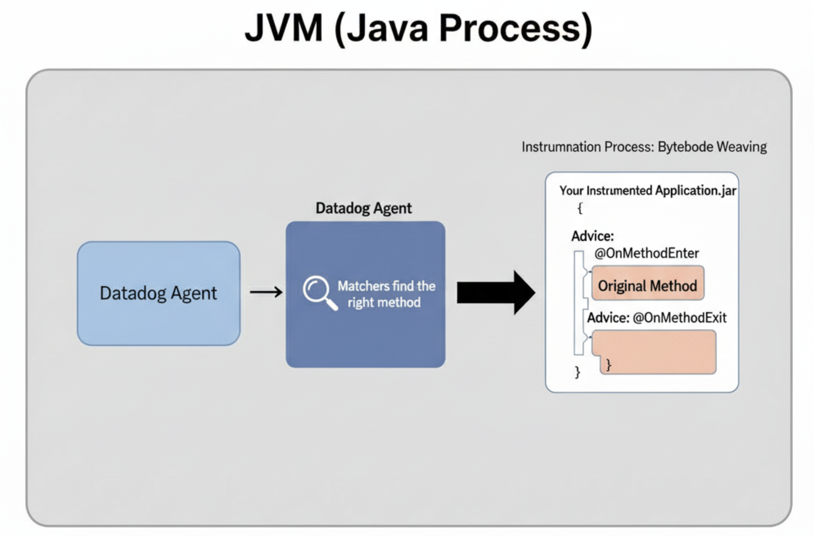
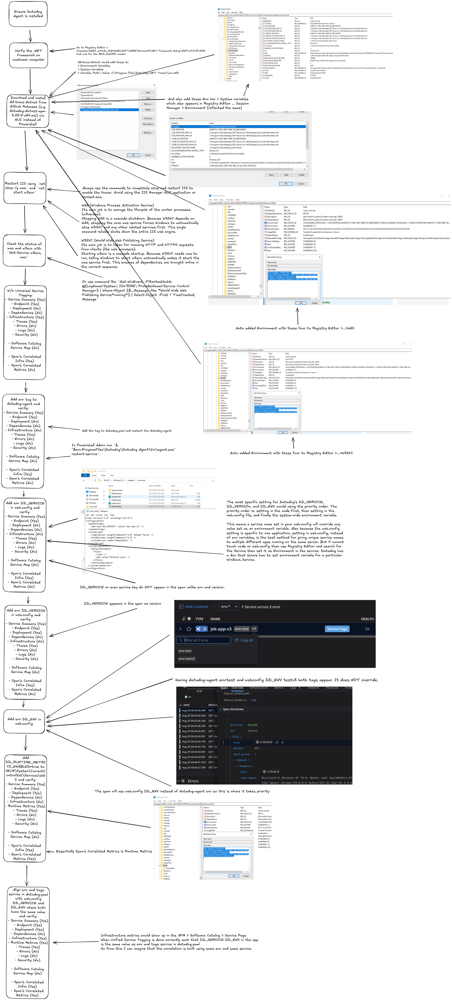

A strategic approach to distilling complex architectures into clear, visual representations. Not affiliated with or endorsed by any organisation. All diagrams reflect my personal learning.

# Metrics

## Metrics DogStatsD

---

# Traces

## Trace Anatomy

## Trace Instrumentation

## Trace dd-trace-py's ddtrace-run command

## Trace dd-trace-java command

### The Core Idea of dd-trace-java: A Smart Assistant for Your Code

Imagine your application's code is a series of instruction manuals for your computer. You want to know exactly when each instruction starts and stops, but you can't rewrite all the manuals yourself.

The Datadog Java Agent (`dd-trace-java`) acts like a **smart assistant** that the Java Virtual Machine (JVM) hires. As the JVM loads each instruction manual (your code), the assistant quickly **adds little "start" and "stop" notes** in the margins of the relevant pages before handing them off to be executed. This process is called **Bytecode Instrumentation**. It happens automatically in memory, without ever changing your original source code files.
### How the "Smart Assistant" Works (The Key Steps)

The tracer is made up of many small, independent tools called **Instrumentation Modules**. Each module is designed to instrument one specific library (like a database driver or a web framework).
Here’s the simple, two-step job of each module:
#### 1. Find the Right Place to Add Notes (`Matchers`)

First, the module has to know _where_ to add its tracing notes. It doesn't just add them everywhere. It uses a set of rules, called **matchers**, to find the exact methods it cares about.
- **A "Type Matcher"** asks: "Am I looking at a class from the PostgreSQL database driver?"
- **A "Method Matcher"** then asks: "Okay, now am I looking at the specific `execute()` method inside that class?"
This is like the assistant knowing to only look for "Chapter 5, Page 3, Paragraph 2" in the instruction manual.

#### 2. Write the Tracing Notes (`Advice`)

Once a matcher finds the right spot, it injects tiny pieces of code called **Advice**. This is the code that actually creates the Datadog spans (the "start" and "stop" notes).
- **`@OnMethodEnter`**: This advice code runs _just before_ the original method starts. It's responsible for starting a new span (the "start" note).
- **`@OnMethodExit`**: This advice code runs _just after_ the original method finishes (either by returning or throwing an error). It's responsible for closing the span and recording how long it took (the "stop" note).
The brilliant part is that the advice code can even share information between the "enter" and "exit" steps, like passing the start time from the `@OnMethodEnter` code to the `@OnMethodExit` code. Source: https://github.com/DataDog/dd-trace-java/blob/master/docs/how_instrumentations_work.md

### Trace dd-trace-dotnet on Windows Server 2022

The diagram illustrates how **dd-trace-dotnet** instruments a .NET application on a Windows Server. Here's a breakdown of the process:

1. **.NET Application Starts**: The process begins when your .NET application or Windows Service starts on the Windows Server.
2. **CLR and JIT Compiler**: The **Common Language Runtime (CLR)** and its **Just-In-Time (JIT) Compiler** are fundamental to this process. The JIT compiler's role is to compile the **Intermediate Language (IL)** code of your application into native machine code that can be executed by the processor. This is done by setting environment variables (`COR_ENABLE_PROFILING=1` and `COR_PROFILER={Your-Profiler-GUID i.e. Datadog’s profiler CLSID}`). (For .NET Core/5+/6+ it’s the `CORECLR_*` equivalents, same GUID.) When an IIS app pool spins up **w3wp.exe**, the .NET CLR looks for above two environment variables
3. **CLR Profiling API**: This is a powerful API that allows a profiler (in this case, dd-trace-dotnet) to attach to the CLR and receive notifications about various events, including when methods are about to be JIT-compiled. In short, once loaded, the profiler uses the CLR Profiling API to subscribe to runtime events via `ICorProfilerInfo::SetEventMask(2)`. It listens for module/assembly loads and (re)JIT events so it can **modify IL** of specific target methods before or after they’re JIT compiled.
4. **dd-trace-dotnet Profiler**: This is a native library that's loaded by the CLR. It uses the Profiling API to "hook" into the JIT compilation process.
5. **IL Rewriting**: As the JIT compiler is about to compile a method, the **dd-trace-dotnet Profiler** intercepts the process and performs **IL Rewriting**. This means it injects additional IL code into the method. This injected code is what captures the tracing information, such as when a method starts and ends. 
6. **dd-trace-dotnet Managed Library**: The injected IL code calls functions in the **dd-trace-dotnet Managed Library**. This library is responsible for creating and managing the spans and traces that represent the execution of your application. The managed tracer batches spans and sends them to the **Datadog Agent** (default `localhost:8126`) over HTTP; you can override via `DD_AGENT_HOST` / `DD_TRACE_AGENT_URL`. If turn on **runtime metrics** (`DD_RUNTIME_METRICS_ENABLED=true`), the tracer listens to .NET **EventCounters** and ships metrics via **DogStatsD** (UDP 8125 by default). Continuous Profiler (optional) rides along in the same loader; enable separately if you want CPU/wall‑time/locks/alloc profiles.
7. **Datadog Agent**: The managed library sends the collected trace data to the **Datadog Agent**, which is a separate process running on the server. 
8. **Datadog Backend**: Finally, the Datadog Agent forwards the trace data to the **Datadog Backend**, where it is processed, indexed, and made available for you to view and analyze in the Datadog UI.
This entire process happens automatically, without requiring any changes to your application's source code. By leveraging the .NET Profiling API and IL rewriting, **dd-trace-dotnet** can provide deep insights into the performance of your .NET applications and services.

Gotchas:
- **Only one profiler** at a time. If you have another profiler (coverage, RUM SDKs that use CLR profilers, etc.) you’ll conflict. Decide which one wins.

Source: GenAI

---

# Logs

## Logs Ingest Pathway

---

# Infrastructure

## Infrastructure Kubernetes Agents

## Infrastructure Docker Agent

- The Wrapper (ddtrace-run) is the outermost box: It starts first and creates the tracing environment for everything that happens inside it.

- The Runner (uv run) is the middle box: It runs inside the wrapper's environment. Its job is to set up the correct Python virtual environment and context for your application.

- The App (main.py) is at the core: It runs inside the runner's context, which itself is inside the wrapper's tracing environment.

# Database

## MySQL
![[mysql.png]]
### **Brief summary: Datadog Agent and MySQL**
Datadog's database monitoring for MySQL relies on the **Datadog Agent**. You install this agent on a host that has network access to your MySQL instance. The agent connects to the database as a read-only user to collect a variety of telemetry data. For self-hosted databases, it's best to have the agent on the same host as the database. For managed services like Amazon RDS, the agent connects remotely.
### **Configuration and Setup**
To enable data collection, you need to:
1. **Create a Datadog user in MySQL**: This is a dedicated user for the Datadog Agent.
2. **Grant permissions**: The Datadog user needs specific permissions to access the necessary data. The core permissions are `SELECT` on all databases and tables, and `EXECUTE` on certain procedures.
3. **Configure the Agent**: You'll need to edit the `mysql.d/conf.yaml` file in your Agent's configuration directory. This file contains the connection details for your MySQL instance, as well as options for customizing data collection.
### **Data Collection Mechanisms**
The Datadog Agent uses several mechanisms to collect data from your MySQL database.
#### **1. Performance Schema**
The **Performance Schema** is a powerful feature in MySQL that provides detailed information about server execution. Datadog leverages it to collect:
- **Query Metrics**: The `events_statements_summary_by_digest` table is a key source of information. It provides aggregated statistics about queries, such as execution time, number of rows returned, and number of errors.
- **Wait Events**: The `events_waits_current`, `events_waits_history`, and `events_waits_history_long` tables provide information about what the database is waiting on, which is crucial for identifying bottlenecks.
- **Stage Events**: The `events_stages_current`, `events_stages_history`, and `events_stages_history_long` tables provide information about the different stages of query execution.
#### **2. System Views and Tables**
The agent queries various system views and tables to gather information about the database's state and performance. These include:
- **`sys.schema_table_statistics`**: This view provides information about table usage, such as the number of rows fetched, inserted, updated, and deleted.
- **`information_schema`**: The agent uses this to gather metadata about databases, tables, and other objects.
- **Standard MySQL Metrics**: The agent runs commands like `SHOW GLOBAL STATUS` and `SHOW VARIABLES` to collect a wide range of metrics about the database's health and performance. It also queries `INNODB_METRICS` for detailed information about the InnoDB storage engine.
#### **3. `EXPLAIN` Plans**
To help you understand how the database is executing your queries, the agent can collect **`EXPLAIN` plans**. It does this by running the `EXPLAIN` command on a sample of your queries. The agent has a stored procedure that it uses to do this safely and efficiently.
#### **4. Log Collection**
The Datadog Agent can also be configured to collect and parse your MySQL logs. This includes:
- **Error log**: This log contains information about errors that have occurred in the database.
- **Slow query log**: This log contains information about queries that have taken a long time to execute.
- **General log**: This log contains information about all queries that have been executed.
The agent can be configured to tail these log files and parse them for useful information.
### **Data Transmission and Processing**
Once the agent has collected the data, it sends it to the Datadog platform. There, the data is processed and made available in dashboards, notebooks, and other visualizations. Datadog also provides a number of features for analyzing and alerting on your database telemetry data.
### **Advanced Configuration**
The Datadog Agent provides a number of advanced configuration options that allow you to fine-tune data collection. For example, you can:
- **Adjust the collection interval**: This controls how often the agent collects data from the database.
- **Control the query sampling rate**: This controls how many of your queries the agent collects `EXPLAIN` plans for.
- **Obfuscate sensitive data**: The agent can be configured to obfuscate sensitive data in your queries before sending it to Datadog.